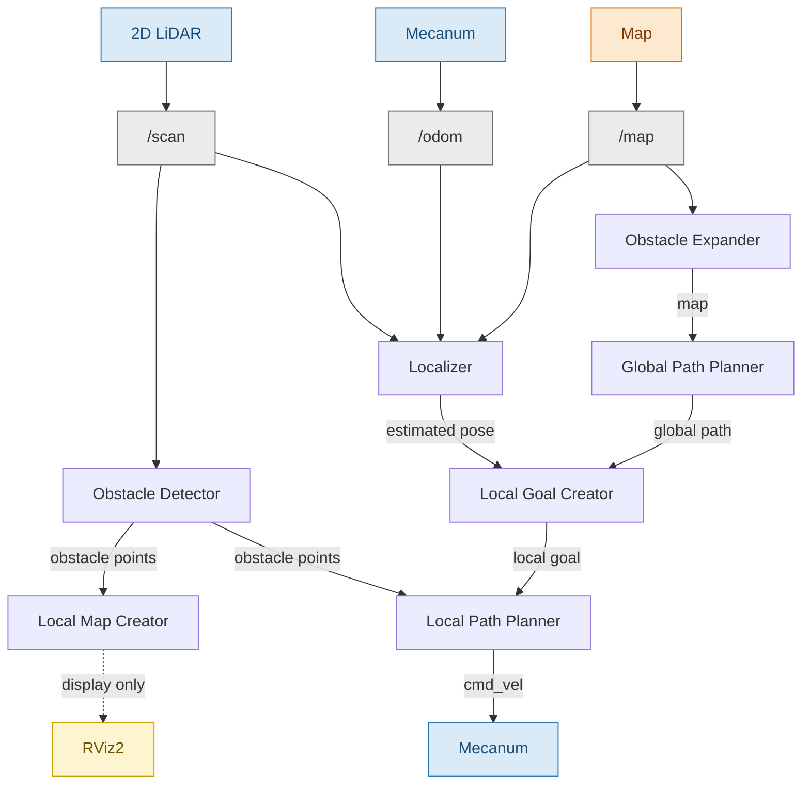

# chibi26_c

（AMSL 2026 研修 cチーム用）
ROS2 Humble を用いたメカナムホイールロボットの自律走行システム．

---

## システム構成

### トピックフロー



### ノード一覧

| ノード名 | 入力トピック | 出力トピック | アルゴリズム |
|---|---|---|---|
| Obstacle Expander | /map | /new_map | インフレーション |
| Global Path Planner | /new_map | /global_path | A* |
| Localizer | /odom, /scan, /map | /estimated_pose | AMCL |
| Obstacle Detector | /scan | /obstacle_points | LiDAR処理 |
| Local Goal Creator | /global_path, /estimated_pose | /local_goal | 目標点選択 |
| Local Map Creator | /obstacle_points | /local_map | RViz2表示用 |
| Local Path Planner | /local_goal, /obstacle_points | /cmd_vel | DWA |
---

## パッケージ一覧

| パッケージ | 役割 | 詳細 |
|---|---|---|
| global_path_planner | A* による大域経路計画 | [README](./global_path_planner/README.md) |
| local_goal_creator  | 局所目標点の生成 | README（未作成） |
| local_map_creator   | 局所地図の生成 | README（未作成） |
| local_path_planner  | DWA による局所経路計画 | README（未作成） |
| localizer           | パーティクルフィルタによる自己位置推定 | README（未作成） |

---

## 環境

| 項目 | 内容 |
|---|---|
| OS | Ubuntu 24.04.3 LTS |
| ROS | ROS 2 Humble |
| 実行環境 | Docker コンテナ |
| 言語 | C++,Python,CMake |

---

## ビルド・実行

````bash
cd ~/ws
colcon build
source install/setup.bash
ros2 launch moebius_ros2 driver_lidar.launch.py
ros2 launch team_c_local_path_planner team_c_play.py