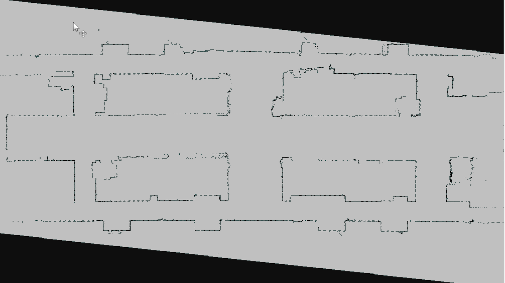
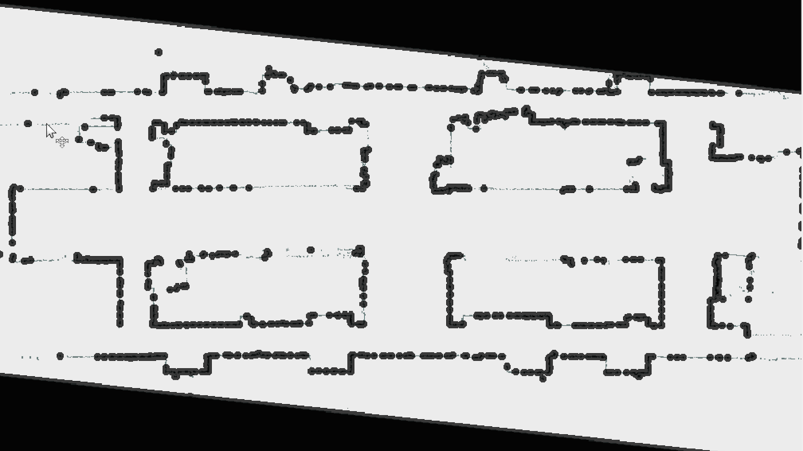
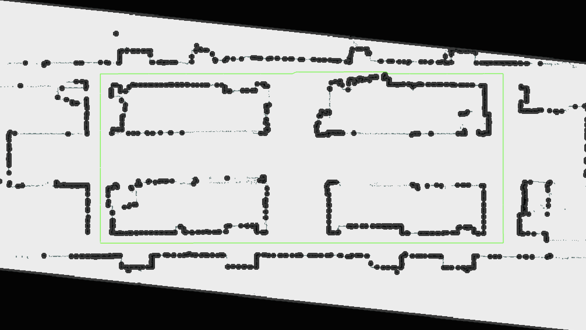

# team_global_path_planner

A* (A-ster) 探索法を用いてウェイポイント間の大域経路を生成するノード．
障害物を事前に拡張（エクスパンド）した上で探索を行う．

今回はD館1階のスタート地点 -> 4角 -> ゴール地点をウェイポイントとし，館内を1周させる．

---

## アルゴリズム概要

### A* 探索法

各ノードのコスト $f$ を以下の式で評価し，最小のノードを優先的に展開し探索を行う．

$$
f(n) = g(n) + h(n)
$$

| *記号* | *意味* |
| --- | --- |
| $g(n)$ | スタートからノード $n$ までの実コスト（累積移動距離） |
| $h(n)$ | ノード $n$ からゴールまでのヒューリスティックコスト |
| $f(n)$ | 総コスト（これを最小化する） |

ヒューリスティック関数にはユークリッド距離を使用する．

$$
h(n) = \sqrt{(x_{goal} - x_n)^2 + (y_{goal} - y_n)^2}
$$

### 移動モデル

8方向移動（前後左右＋斜め4方向）を採用する．

| 方向 | コスト |
|---|---|
| 前後左右 | 1.0 |
| 斜め | $\sqrt{2} \approx 1.4142$ |

### 障害物拡張（インフレーション）

ロボットの半径を考慮し，占有格子地図上の障害物セルを `margin` パラメータ分だけ円形に拡張する．

$$
d = \sqrt{(i - x_{obs})^2 + (j - y_{obs})^2} \leq \left\lceil \frac{margin}{resolution} \right\rceil
$$

満たすセルをすべて障害物として扱う．

---

## 処理フロー

````
map_callback()
    │
    v
obs_expander()    <- 障害物を margin 分だけ拡張
    │
    v
planning()
    │
    ├─ ウェイポイントごとにループ
    │       │
    │       ├─ select_min_f()   <- Open リストから f 値最小ノードを選択
    │       ├─ check_goal()     <- ゴール到達判定
    │       ├─ swap_node()      <- Open -> Close リストへ移動
    │       └─ update_list()    <- 隣接ノードを評価・リスト更新
    │
    └─ create_path()            <- Close リストを遡ってパスを生成
````

---

## トピック

| トピック名 | 型 | 方向 | 説明 |
|---|---|---|---|
| `/map` | nav_msgs/OccupancyGrid | Subscribe | 占有格子地図 |
| `/global_path` | nav_msgs/Path | Publish | 生成した大域経路 |
| `/new_map` | nav_msgs/OccupancyGrid | Publish | 障害物拡張後のマップ |
| `/node_point` | geometry_msgs/PointStamped | Publish | デバッグ用・探索ノード位置 |

---

## パラメータ

| パラメータ名 | 型 | 単位 | 説明 |
|---|---|---|---|
| `margin` | double | m | 障害物拡張マージン |
| `way_points_x` | double[] | m | 経由点の x 座標リスト |
| `way_points_y` | double[] | m | 経由点の y 座標リスト |
| `test_show` | bool | - | デバッグ表示の有効化 |

---

## 動作確認

### 1. 入力マップ（点群）

LiDARによって取得した占有格子地図．黒点が障害物，白が空き空間を示す．



### 2. 障害物拡張後のマップ

`margin` パラメータ分だけ障害物を円形に拡張したマップ．
ロボットの機体サイズを考慮し，経路探索時に安全距離を確保する．




### 3. 大域経路（A* 探索結果）

A* アルゴリズムによって生成された大域経路（緑線）．
ウェイポイント間を障害物を回避しながら接続する．



---

## 実装上の注意点

ウェイポイント間の探索はフェーズごとに独立して行われ．
各フェーズ開始時に `start_node_` のコスト（`g`, `f`）を
必ずリセットすること．リセットしない場合，後半フェーズで
`f` 値が異常に大きくなり探索が失敗する．